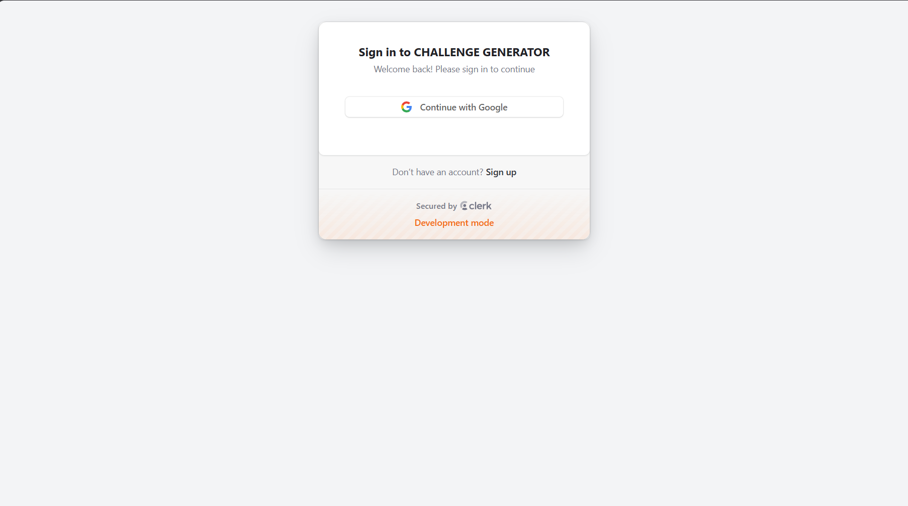
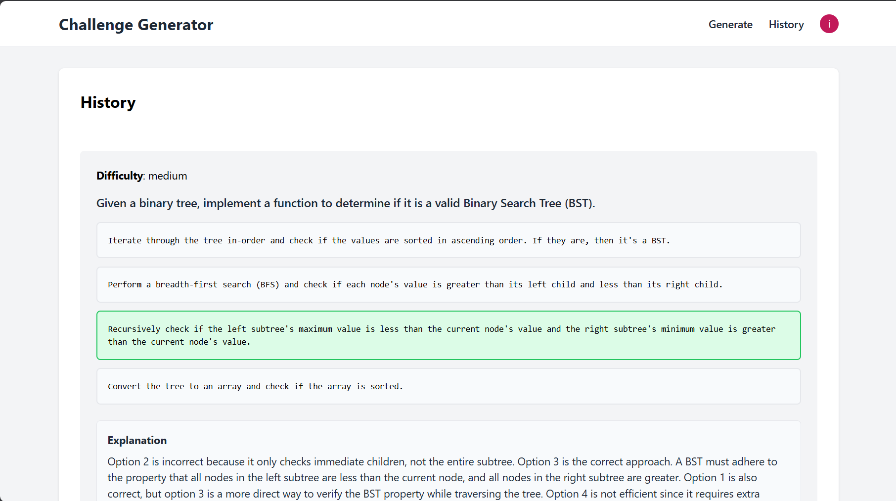

# FS-Code-Callenge-Generator# Code-Challenge-Generator

A full stack web to generate code challenge with Gemini, complete user authentication using Clerk and daily quota system

## 🚀 **[Demo](https://code-challenge-generator.vercel.app)** 🚀

## Interface

## 🛠️ Tech Stack
* **frontend :** React, Vite
* **backend :** Python, FastAPI
* **Database :** PostgreSQL
* **Authentication:** Clerk
* **Generatve AI:** Gemini
* **Deployment:** Vercel, Railway

## ✨Feature
* **signin with google account**
* **Generate Code Challenge based on difficulty (Easy, Medium, Hard)**
* **Explanation about the challenge that have generated**
* **Daily quota for every user**
* **History challenge generated**